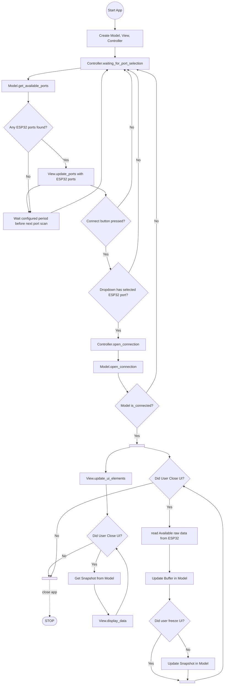
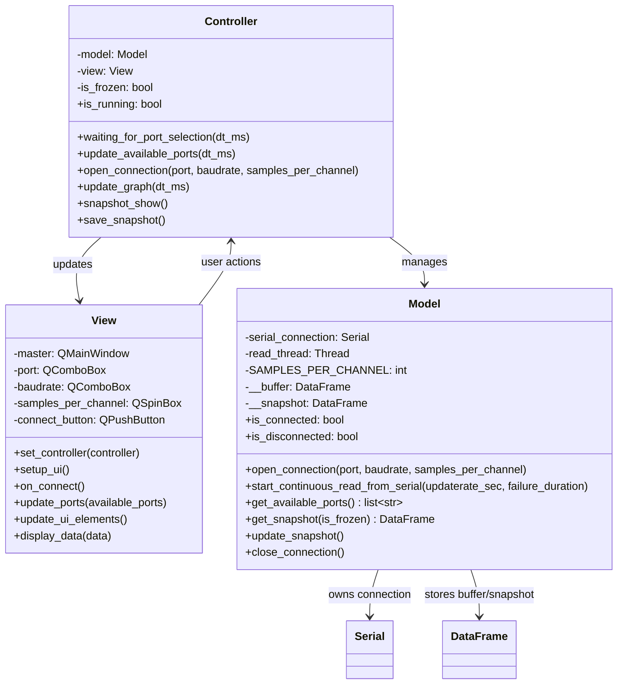

## Connection and Update Flow

```mermaid
flowchart
    start((Start App))

    fork_stop@{ shape: fork, label: "Fork or Join" }
    is_running_ui -->|No| fork_stop
    fork_stop  -. close app .-> stop
    stop([STOP])
    setup[Create Model, View, Controller]
    wait_loop[Controller.waiting_for_port_selection]
    scan_ports[Model.get_available_ports]
    detect_esp32{Any ESP32 ports found?}
    update_dropdown[View.update_ports with ESP32 ports]
    keep_waiting[Wait configured period before next port scan]

    connect_btn{Connect button pressed?}
    port_selected{Dropdown has selected ESP32 port?}
    open_conn[Controller.open_connection]
    model_open[Model.open_connection]
    conn_ok{Model is_connected?}
    lock_ui[View.update_ui_elements]
    read_snapshot[Get Snapshot from Model]
    render_view[View.display_data]

    start --> setup --> wait_loop --> scan_ports --> detect_esp32
    detect_esp32 -->|Yes| update_dropdown --> keep_waiting --> wait_loop
    detect_esp32 -->|No| keep_waiting

    update_dropdown --> connect_btn
    connect_btn -->|No| wait_loop
    connect_btn -->|Yes| port_selected
    port_selected -->|No| wait_loop
    port_selected -->|Yes| open_conn --> model_open --> conn_ok
    is_running_ui{Did User Close UI?}
    conn_ok -->|No| wait_loop
    conn_ok -->|Yes| fork1 
    fork1@{ shape: fork, label: "Fork or Join" }
    
    is_running_ui -->|Yes| read_snapshot
    read_snapshot --> render_view --> is_running_ui
    fork1 --> lock_ui --> is_running_ui 

    fork1 --> is_running_data 
    is_running_data -->|Yes| read_data
    read_data[read Available raw data from ESP32] --> update_buffer
    update_buffer[Update Buffer in Model] 
    update_buffer --> user_frozen
    user_frozen{Did user freeze UI?} -->|No| update_snapshot
    user_frozen -->|Yes| fork_frozen
    fork_frozen@{ shape: fork, label: "Fork or Join" }
    fork_frozen --> is_running_data
    update_snapshot[Update Snapshot in Model] --> fork_frozen
    is_running_data{Did User Close UI? }
    is_running_data -->|No| fork_stop

```

## MVC Class Diagram

```mermaid
classDiagram
    class Controller {
        -model: Model
        -view: View
        -is_frozen: bool
        +waiting_for_port_selection(dt_ms)
        +update_available_ports(dt_ms)
        +open_connection(port, baudrate, samples_per_channel)
        +update_graph(dt_ms)
        +snapshot_show()
        +save_snapshot()
        +is_running: bool
    }

    class View {
        -master: QMainWindow
        -port: QComboBox
        -baudrate: QComboBox
        -samples_per_channel: QSpinBox
        -connect_button: QPushButton
        +set_controller(controller)
        +setup_ui()
        +on_connect()
        +update_ports(available_ports)
        +update_ui_elements()
        +display_data(data)
    }

    class Model {
        -serial_connection: Serial
        -read_thread: Thread
        -SAMPLES_PER_CHANNEL: int
        -__buffer: DataFrame
        -__snapshot: DataFrame
        +open_connection(port, baudrate, samples_per_channel)
        +start_continuous_read_from_serial(updaterate_sec, failure_duration)
        +get_available_ports() list~str~
        +get_snapshot(is_frozen) DataFrame
        +update_snapshot()
        +is_connected: bool
        +is_disconnected: bool
        +close_connection()
    }

    class Serial
    class DataFrame

    Controller --> Model : manages
    Controller --> View : updates
    View --> Controller : user actions
    Model --> Serial : owns connection
    Model --> DataFrame : stores buffer/snapshot
```

